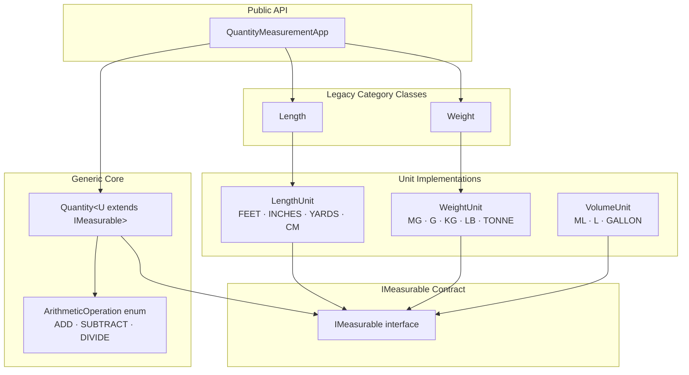

# Quantity Measurement System

> A type-safe, immutable, generic measurement library built incrementally through 13 use cases — demonstrating disciplined TDD, SOLID principles, and evolutionary system design in Java.

[](https://openjdk.org/)
[](https://junit.org/junit5/)
[](#running-tests)
[](#license)

---

## Navigation

- [Overview](#overview)
- [Problem Statement](#problem-statement)
- [Architecture](#architecture)
- [Supported Units](#supported-units)
- [API Reference](#api-reference)
- [Arithmetic Pipeline](#arithmetic-pipeline)
- [Design Decisions](#design-decisions)
- [Project Structure](#project-structure)
- [Getting Started](#getting-started)
- [Running Tests](#running-tests)
- [Use Case Progression](#use-case-progression)
- [Future Improvements](#future-improvements)
- [Contributing](#contributing)

---

## Overview

This system provides a **generic, type-safe measurement abstraction** for physical quantities. It supports cross-unit arithmetic (add, subtract, divide), unit conversion, and equality comparison — all without duplicating conversion logic across measurement categories.

The core insight: a single generic class `Quantity<U extends IMeasurable>` handles all measurement categories. Adding a new unit type (e.g., `TemperatureUnit`) requires implementing one interface and one enum — zero changes to the arithmetic engine.

**What it solves:**

- Cross-unit arithmetic without hardcoded conversion tables
- Type-safe prevention of mixing incompatible categories (length vs weight)
- Immutable value semantics — operations always return new objects
- Centralized validation and arithmetic dispatch (UC13 DRY refactor)

---

## Problem Statement

Measurement systems in software typically suffer from one of two failure modes:

1. **Hardcoded conversion tables** — brittle, duplicated, scattered across the codebase
2. **Stringly-typed units** — no compile-time safety, runtime errors from category mismatches

This project addresses both by encoding conversion logic inside the unit enum itself (`IMeasurable`) and using Java generics to enforce category safety at compile time. A `Quantity<LengthUnit>` cannot be compared to a `Quantity<WeightUnit>` — the type system prevents it, and runtime checks enforce it.

---

## Architecture

### System Overview



### Arithmetic Pipeline

```mermaid
sequenceDiagram
    participant C as Caller
    participant Q as Quantity&lt;U&gt;
    participant V as validateOperands()
    participant P as performArithmetic()
    participant U as IMeasurable (unit enum)

    C->>Q: add(other) / subtract(other) / divide(other)
    Q->>V: validate(other, targetUnit, required)
    V-->>Q: OK or IllegalArgumentException
    Q->>P: performArithmetic(other, ADD|SUBTRACT|DIVIDE)
    P->>U: this.unit.convertToBaseUnit(this.value)
    P->>U: other.unit.convertToBaseUnit(other.value)
    P-->>Q: baseResult
    Q->>U: targetUnit.convertFromBaseUnit(baseResult)
    Q-->>C: new Quantity&lt;U&gt;(result, targetUnit)
```

### Conversion Pipeline


Each unit's `conversionFactor` is the number of base units one unit equals:

| Category | Base Unit | Example Factor |
|----------|-----------|----------------|
| Length   | FEET      | INCHES = 1/12  |
| Weight   | GRAM      | KILOGRAM = 1000 |
| Volume   | LITRE     | MILLILITRE = 0.001 |

### Equality Contract

```mermaid
flowchart TD
    A[equals called] --> B{same reference?}
    B -->|yes| T[true]
    B -->|no| C{obj null?}
    C -->|yes| F[false]
    C -->|no| D{same class?}
    D -->|no| F
    D -->|yes| E{same unit category?}
    E -->|no| F
    E -->|yes| G[convert both to base unit]
    G --> H{|a - b| < ε}
    H -->|yes| T
    H -->|no| F
```

---

## Supported Units

### Length (`LengthUnit`) — base: FEET

| Constant | Factor | Equivalent |
|----------|--------|------------|
| `FEET` | 1.0 | base unit |
| `INCHES` | 1/12 | 12 in = 1 ft |
| `YARDS` | 3.0 | 1 yd = 3 ft |
| `CENTIMETERS` | 1/30.48 | 30.48 cm = 1 ft |

### Weight (`WeightUnit`) — base: GRAM

| Constant | Factor | Equivalent |
|----------|--------|------------|
| `MILLIGRAM` | 0.001 | 1000 mg = 1 g |
| `GRAM` | 1.0 | base unit |
| `KILOGRAM` | 1000.0 | 1 kg = 1000 g |
| `POUND` | 453.592 | 1 lb = 453.592 g |
| `TONNE` | 1,000,000 | 1 t = 1,000,000 g |

### Volume (`VolumeUnit`) — base: LITRE

| Constant | Factor | Equivalent |
|----------|--------|------------|
| `MILLILITRE` | 0.001 | 1000 mL = 1 L |
| `LITRE` | 1.0 | base unit |
| `GALLON` | 3.78541 | 1 gal ≈ 3.785 L |

---

## API Reference

### `Quantity<U extends IMeasurable>`

```java
// Construction
new Quantity<>(double value, U unit)

// Accessors
double getValue()
U      getUnit()

// Conversion
Quantity<U> convertTo(U targetUnit)

// Arithmetic — result in caller's unit
Quantity<U> add(Quantity<U> other)
Quantity<U> subtract(Quantity<U> other)

// Arithmetic — result in explicit target unit
Quantity<U> add(Quantity<U> other, U targetUnit)
Quantity<U> subtract(Quantity<U> other, U targetUnit)

// Division — dimensionless scalar
double divide(Quantity<U> other)

// Object contract
boolean equals(Object obj)   // base-unit epsilon comparison
int     hashCode()           // consistent with equals
String  toString()           // "1.0 FEET"
```

### `IMeasurable` (unit enum contract)

```java
double getConversionFactor()
double convertToBaseUnit(double value)
double convertFromBaseUnit(double baseValue)
String getUnitName()
```

### `QuantityMeasurementApp` (static utility facade)

```java
// Generic operations (UC10+)
Quantity<U> convert(Quantity<U> q, U targetUnit)
Quantity<U> add(Quantity<U> q1, Quantity<U> q2)
Quantity<U> add(Quantity<U> q1, Quantity<U> q2, U targetUnit)
Quantity<U> demonstrateSubtraction(Quantity<U> q1, Quantity<U> q2)
Quantity<U> demonstrateSubtraction(Quantity<U> q1, Quantity<U> q2, U targetUnit)
double      demonstrateDivision(Quantity<U> q1, Quantity<U> q2)

// Legacy length operations (UC5–UC7)
double  convert(double value, LengthUnit from, LengthUnit to)
Length  demonstrateLengthAddition(Length l1, Length l2)
Length  demonstrateLengthAddition(Length l1, Length l2, LengthUnit target)

// Legacy weight operations (UC9)
double  convertWeight(double value, WeightUnit from, WeightUnit to)
Weight  demonstrateWeightAddition(Weight w1, Weight w2)
Weight  demonstrateWeightAddition(Weight w1, Weight w2, WeightUnit target)
```

---

## Arithmetic Pipeline

All arithmetic in `Quantity<U>` flows through two private methods (UC13 DRY refactor):

```
add(other)              ──▶  computeQuantityResult(other, this.unit, ADD)
add(other, target)      ──▶  computeQuantityResult(other, target,    ADD)
subtract(other)         ──▶  computeQuantityResult(other, this.unit, SUBTRACT)
subtract(other, target) ──▶  computeQuantityResult(other, target,    SUBTRACT)
divide(other)           ──▶  validateOperands + performArithmetic(DIVIDE) + zero check
```

`computeQuantityResult` is the single source of truth:

```
1. validateOperands(other, targetUnit, required)
2. performArithmetic(other, operation)
   └── this.unit.convertToBaseUnit(this.value)
   └── other.unit.convertToBaseUnit(other.value)
   └── ArithmeticOperation.apply(a, b)
3. targetUnit.convertFromBaseUnit(baseResult)
4. return new Quantity<>(result, targetUnit)
```

`ArithmeticOperation` is a private enum using `DoubleBinaryOperator`:

```java
ADD      ((a, b) -> a + b)
SUBTRACT ((a, b) -> a - b)
DIVIDE   ((a, b) -> a / b)
```

---

## Design Decisions

**Why `IMeasurable` as an interface rather than an abstract class?**
Enums cannot extend classes in Java. The interface contract allows enums to implement it directly, keeping unit definitions as self-contained, immutable singletons.

**Why store conversion factors relative to a per-category base unit rather than a universal base (SI)?**
It keeps each enum self-contained and avoids coupling between measurement categories. Cross-category comparison is intentionally impossible — the type system enforces it.

**Why `DoubleBinaryOperator` in `ArithmeticOperation` rather than abstract methods?**
Each operation is a pure mathematical function of two doubles. A lambda is the most direct expression of that. Abstract methods would add boilerplate without adding clarity.

**Why epsilon-based equality (`1e-7`) rather than exact `Double.compare`?**
Floating-point conversion chains accumulate rounding error. For example, `1 cm` expressed in feet via `1/30.48` and `0.393701 in` expressed in feet via `0.393701/12` differ by ~`1.77e-8`. Exact comparison would produce false negatives for mathematically equivalent quantities.

**Why keep `Length` and `Weight` classes alongside `Quantity<U>`?**
`Length` and `Weight` were introduced in UC1–UC9 before the generic architecture existed (UC10). They are preserved for backward compatibility. New code should use `Quantity<LengthUnit>` and `Quantity<WeightUnit>` directly.

**Why `WeightUnit` uses `BigDecimal` rounding but `LengthUnit` does not?**
`WeightUnit` was specified with 2 decimal place rounding in UC9. `LengthUnit` predates that requirement. The behavior difference is intentional and preserved.

---

## Project Structure

```
Quantity-Measurement-App/
├── src/
│   └── com/apps/quantitymeasurement/
│       ├── IMeasurable.java              # Interface contract for all unit enums
│       ├── Quantity.java                 # Generic immutable measurement (core)
│       ├── LengthUnit.java               # Length units: FEET, INCHES, YARDS, CM
│       ├── WeightUnit.java               # Weight units: MG, G, KG, LB, TONNE
│       ├── VolumeUnit.java               # Volume units: ML, L, GALLON
│       ├── Length.java                   # Legacy length class (UC1–UC8)
│       ├── Weight.java                   # Legacy weight class (UC9)
│       ├── QuantityMeasurementApp.java   # Static facade / demo entry point
│       └── QuantityMeasurementAppTest.java  # 177 JUnit 5 tests
├── lib/
│   └── junit-platform-console-standalone-1.10.2.jar
├── out/
│   └── test/                            # Compiled .class files
├── docs/
│   ├── architecture.md
│   ├── api.md
│   ├── data-flow.md
│   └── contributing.md
└── README.md
```

---

## Getting Started

### Prerequisites

- Java 11+ (tested on Java 25)
- No build tool required — plain `javac`

### Compile

```bash
javac -cp "lib/junit-platform-console-standalone-1.10.2.jar" \
      -d out/test \
      src/com/apps/quantitymeasurement/*.java
```

### Running Tests

```bash
java -jar lib/junit-platform-console-standalone-1.10.2.jar \
     --class-path out/test \
     --select-class com.apps.quantitymeasurement.QuantityMeasurementAppTest
```

Expected output:

```
177 tests found
177 tests successful
  0 tests failed
```

### Usage Example

```java
// Generic API (recommended)
Quantity<LengthUnit> oneFoot   = new Quantity<>(1.0, LengthUnit.FEET);
Quantity<LengthUnit> twelveIn  = new Quantity<>(12.0, LengthUnit.INCHES);

oneFoot.equals(twelveIn);                          // true — base-unit comparison
oneFoot.add(twelveIn);                             // 2.0 FEET
oneFoot.add(twelveIn, LengthUnit.INCHES);          // 24.0 INCHES
oneFoot.subtract(twelveIn);                        // 0.0 FEET
oneFoot.divide(twelveIn);                          // 1.0 (dimensionless)
oneFoot.convertTo(LengthUnit.INCHES);              // 12.0 INCHES

// Weight
Quantity<WeightUnit> oneKg = new Quantity<>(1.0, WeightUnit.KILOGRAM);
Quantity<WeightUnit> fiveG = new Quantity<>(500.0, WeightUnit.GRAM);
oneKg.add(fiveG);                                  // 1.5 KILOGRAM
oneKg.divide(fiveG);                               // 2.0

// Volume
Quantity<VolumeUnit> oneLitre = new Quantity<>(1.0, VolumeUnit.LITRE);
Quantity<VolumeUnit> fiveHundMl = new Quantity<>(500.0, VolumeUnit.MILLILITRE);
oneLitre.subtract(fiveHundMl);                     // 0.5 LITRE

// Cross-category safety — compile-time and runtime
Quantity<LengthUnit> len = new Quantity<>(1.0, LengthUnit.FEET);
Quantity<WeightUnit> wt  = new Quantity<>(1.0, WeightUnit.GRAM);
len.equals(wt);                                    // always false
```

### Adding a New Unit Category

1. Create an enum implementing `IMeasurable`:

```java
public enum TemperatureUnit implements IMeasurable {
    CELSIUS(1.0),
    KELVIN(1.0);   // define your base unit and factors

    // implement: getConversionFactor, convertToBaseUnit,
    //            convertFromBaseUnit, getUnitName
}
```

2. Use it directly with `Quantity<TemperatureUnit>` — no other changes required.

---

## Use Case Progression

The system was built incrementally through 13 use cases, each adding a layer:

| UC | Branch | What was added |
|----|--------|----------------|
| UC1 | `Feature/UC1` | `Feet` equality (TDD baseline) |
| UC2 | `Feature/UC2` | `Inches` equality (independent) |
| UC3 | `Feature/UC3` | Generic `Length` class, `LengthUnit` enum, DRY refactor |
| UC4 | `Feature/UC4` | `YARDS`, `CENTIMETERS` added to `LengthUnit` |
| UC5 | `Feature/UC5` | Static `convert()` API |
| UC6 | `Feature/UC6` | `Length.add()` — base-unit addition |
| UC7 | `Feature/UC7` | `add(other, targetUnit)` overload |
| UC8 | `Feature/UC8` | `IMeasurable` interface, SRP refactor of enums |
| UC9 | `feature/uc9-weight-support` | `WeightUnit`, `Weight` class |
| UC10 | `Feature/UC10` | `Quantity<U extends IMeasurable>` generic class |
| UC11 | `Feature/UC11` | `VolumeUnit` — zero architecture changes |
| UC12 | `Feature/UC12` | `subtract()`, `divide()` operations |
| UC13 | `Refactor/UC13-DRY-Arithmetic` | Centralized `ArithmeticOperation` enum, `validateOperands`, `performArithmetic` |

---

## Future Improvements

- **Maven/Gradle build** — replace manual `javac` with a standard build tool
- **`TemperatureUnit`** — non-linear conversion (Celsius ↔ Kelvin ↔ Fahrenheit) would require overriding the pipeline in the enum
- **`Quantity.multiply(double scalar)`** — scalar multiplication is a natural extension
- **`toString` formatting** — configurable decimal precision in output
- **CI pipeline** — GitHub Actions workflow to run tests on push

---

## Contributing

See [docs/contributing.md](docs/contributing.md) for branch naming, commit conventions, and the TDD workflow used throughout this project.

---

## License

MIT License. See `LICENSE` for details.
