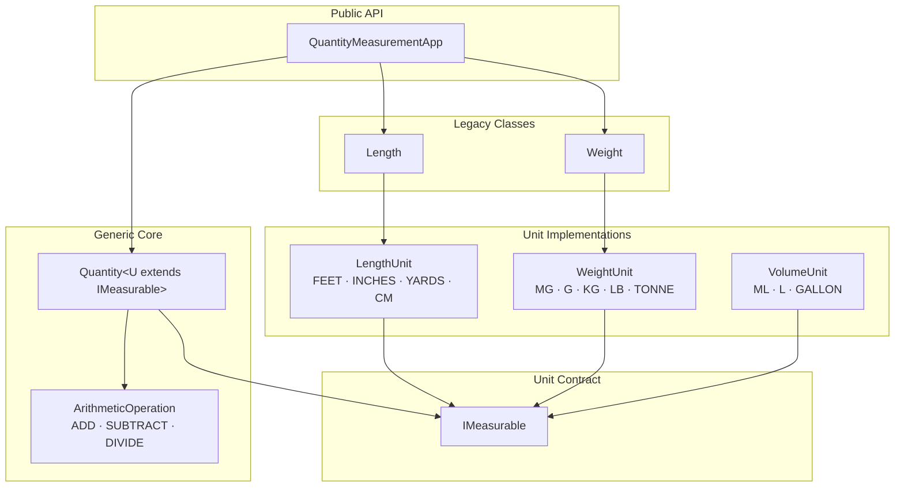

# Quantity Measurement System

> A type-safe, immutable, generic measurement library built incrementally through 13 use cases — demonstrating disciplined TDD, SOLID principles, and evolutionary system design in Java.

[](https://openjdk.org/)
[](https://junit.org/junit5/)
[](#running-tests)
[](#license)

---

## What it does

A single generic class — `Quantity<U extends IMeasurable>` — handles all measurement categories (length, weight, volume). Cross-unit arithmetic, conversion, and equality work out of the box. Adding a new unit type requires implementing one interface and one enum — zero changes to the arithmetic engine.

```java
Quantity<LengthUnit> oneFoot  = new Quantity<>(1.0, LengthUnit.FEET);
Quantity<LengthUnit> twelveIn = new Quantity<>(12.0, LengthUnit.INCHES);

oneFoot.equals(twelveIn);                       // true
oneFoot.add(twelveIn);                          // 2.0 FEET
oneFoot.add(twelveIn, LengthUnit.INCHES);       // 24.0 INCHES
oneFoot.subtract(twelveIn);                     // 0.0 FEET
oneFoot.divide(twelveIn);                       // 1.0 (dimensionless)
```

---

## System Overview



---

## Supported Units

| Category | Base Unit | Constants |
|----------|-----------|-----------|
| Length | FEET | `FEET` `INCHES` `YARDS` `CENTIMETERS` |
| Weight | GRAM | `MILLIGRAM` `GRAM` `KILOGRAM` `POUND` `TONNE` |
| Volume | LITRE | `MILLILITRE` `LITRE` `GALLON` |

---

## Project Structure

```
src/com/apps/quantitymeasurement/
├── IMeasurable.java              # Interface contract for all unit enums
├── Quantity.java                 # Generic immutable measurement (core)
├── LengthUnit.java               # Length units
├── WeightUnit.java               # Weight units
├── VolumeUnit.java               # Volume units
├── Length.java                   # Legacy length class (UC1–UC8)
├── Weight.java                   # Legacy weight class (UC9)
├── QuantityMeasurementApp.java   # Static facade
└── QuantityMeasurementAppTest.java
docs/
├── architecture.md               # System design, layers, diagrams
├── api.md                        # Full API reference
├── data-flow.md                  # Conversion and arithmetic flow diagrams
└── contributing.md               # TDD workflow, branch naming, how to add units
lib/
└── junit-platform-console-standalone-1.10.2.jar
```

---

## Getting Started

**Prerequisites:** Java 11+ (tested on Java 25), no build tool required.

**Compile:**

```bash
javac -cp "lib/junit-platform-console-standalone-1.10.2.jar" \
      -d out/test \
      src/com/apps/quantitymeasurement/*.java
```

**Run tests:**

```bash
java -jar lib/junit-platform-console-standalone-1.10.2.jar \
     --class-path out/test \
     --select-class com.apps.quantitymeasurement.QuantityMeasurementAppTest
```

```
177 tests found | 177 successful | 0 failed
```

---

## Documentation

| Doc | Contents |
|-----|----------|
| [Architecture](docs/architecture.md) | System layers, design decisions, Mermaid diagrams, extension model |
| [API Reference](docs/api.md) | All public methods, signatures, exception contracts |
| [Data Flow](docs/data-flow.md) | Conversion pipeline, arithmetic flow, equality contract, cross-category safety |
| [Contributing](docs/contributing.md) | TDD workflow, branch naming, commit conventions, how to add a unit category |

---

## Use Case Progression

Built incrementally through 13 use cases across feature branches:

| UC | What was added |
|----|----------------|
| UC1–UC2 | `Feet` and `Inches` equality (TDD baseline) |
| UC3–UC4 | Generic `Length` + `LengthUnit` enum, extended units |
| UC5–UC7 | Static conversion API, `add()` with and without explicit target unit |
| UC8 | `IMeasurable` interface, SRP refactor — enums own all math |
| UC9 | `WeightUnit` + `Weight` class |
| UC10 | `Quantity<U extends IMeasurable>` — single generic class for all categories |
| UC11 | `VolumeUnit` — zero architecture changes required |
| UC12 | `subtract()` and `divide()` operations |
| UC13 | DRY refactor — centralized `ArithmeticOperation` enum, `validateOperands`, `performArithmetic` |

---

## License

MIT License.
