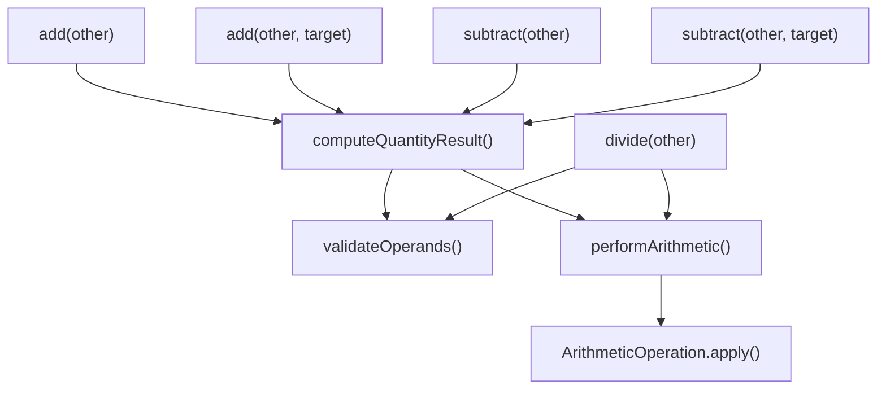

# Architecture

## Core Design

The system is built around three layers:

```
IMeasurable (interface)
    ↑ implemented by
LengthUnit / WeightUnit / VolumeUnit (enums)
    ↑ used by
Quantity<U extends IMeasurable> (generic class)
    ↑ exposed via
QuantityMeasurementApp (static facade)
```

Each layer has a single responsibility:

| Layer | Responsibility |
|-------|---------------|
| `IMeasurable` | Defines the conversion contract |
| Unit enums | Own all conversion math |
| `Quantity<U>` | Owns arithmetic, equality, immutability |
| `QuantityMeasurementApp` | Thin delegation facade |

## Immutability

All fields in `Quantity<U>`, `Length`, and `Weight` are `final`. Every arithmetic operation returns a new object. No setters exist anywhere in the system.

## Type Safety

`Quantity<LengthUnit>` and `Quantity<WeightUnit>` are distinct types at compile time. At runtime, `equals()` additionally checks `unit.getClass()` to prevent cross-category equality returning `true` through raw type usage.

## Arithmetic Centralization (UC13)



Before UC13, `addAndConvert` and `subtractAndConvert` duplicated the same validation and base-unit conversion logic. UC13 collapsed them into:

- `validateOperands` — single null/finite check for all operations
- `performArithmetic` — single base-unit conversion + dispatch
- `ArithmeticOperation` — private enum with `DoubleBinaryOperator` lambdas

## Extending the System

To add a new measurement category:

1. Create `XUnit implements IMeasurable` with conversion factors relative to a chosen base unit
2. Use `Quantity<XUnit>` — no changes to `Quantity`, `IMeasurable`, or any existing code

This satisfies the Open/Closed Principle: the system is open for extension, closed for modification.
