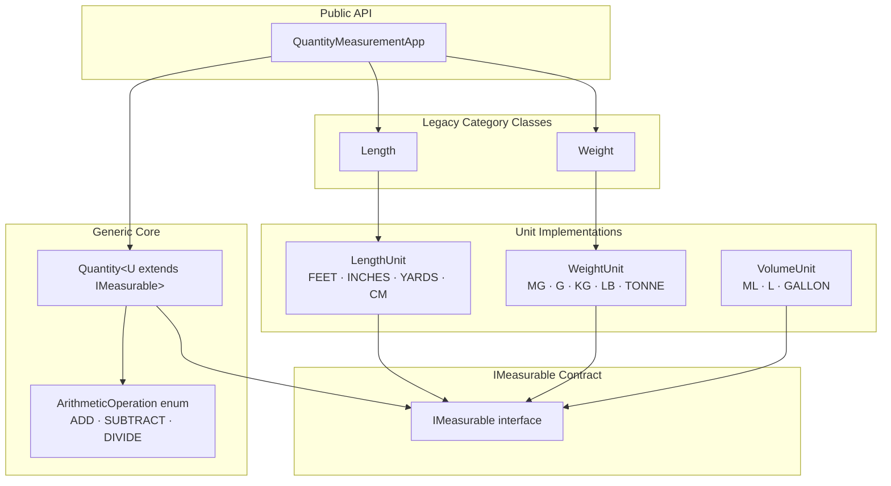
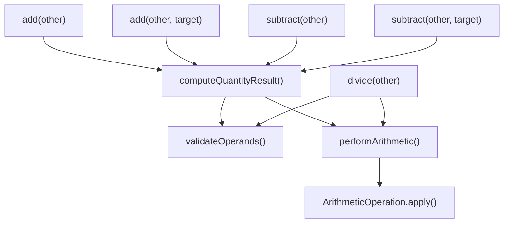

# Architecture

## System Layers

Each layer has a single responsibility:

| Layer | Responsibility |
|-------|---------------|
| `IMeasurable` | Defines the conversion contract |
| Unit enums | Own all conversion math |
| `Quantity<U>` | Owns arithmetic, equality, immutability |
| `QuantityMeasurementApp` | Thin delegation facade |

---

## Immutability

All fields in `Quantity<U>`, `Length`, and `Weight` are `final`. Every arithmetic operation returns a new object. No setters exist anywhere in the system.

---

## Type Safety

`Quantity<LengthUnit>` and `Quantity<WeightUnit>` are distinct types at compile time. At runtime, `equals()` additionally checks `unit.getClass()` to prevent cross-category equality returning `true` through raw type usage.

---

## Arithmetic Centralization (UC13)

Before UC13, `addAndConvert` and `subtractAndConvert` duplicated the same validation and base-unit conversion logic. UC13 collapsed them into three private helpers:

- `validateOperands` — single null/finite check for all operations
- `performArithmetic` — single base-unit conversion + dispatch
- `ArithmeticOperation` — private enum with `DoubleBinaryOperator` lambdas (`ADD`, `SUBTRACT`, `DIVIDE`)

---

## Design Decisions

**Why `IMeasurable` as an interface rather than an abstract class?**
Enums cannot extend classes in Java. The interface contract allows enums to implement it directly, keeping unit definitions as self-contained, immutable singletons.

**Why per-category base units rather than a universal SI base?**
It keeps each enum self-contained and avoids coupling between measurement categories. Cross-category comparison is intentionally impossible — the type system enforces it.

**Why `DoubleBinaryOperator` in `ArithmeticOperation` rather than abstract methods?**
Each operation is a pure mathematical function of two doubles. A lambda is the most direct expression of that. Abstract methods would add boilerplate without adding clarity.

**Why epsilon-based equality (`1e-7`) rather than exact `Double.compare`?**
Floating-point conversion chains accumulate rounding error. For example, `1 cm` expressed in feet via `1/30.48` and `0.393701 in` expressed in feet via `0.393701/12` differ by ~`1.77e-8`. Exact comparison would produce false negatives for mathematically equivalent quantities.

**Why keep `Length` and `Weight` alongside `Quantity<U>`?**
They were introduced in UC1–UC9 before the generic architecture existed (UC10). Preserved for backward compatibility. New code should use `Quantity<LengthUnit>` and `Quantity<WeightUnit>` directly.

**Why does `WeightUnit` use `BigDecimal` rounding but `LengthUnit` does not?**
`WeightUnit` was specified with 2 decimal place rounding in UC9. `LengthUnit` predates that requirement. The difference is intentional and preserved.

---

## Extending the System

To add a new measurement category:

1. Create `XUnit implements IMeasurable` with conversion factors relative to a chosen base unit
2. Use `Quantity<XUnit>` directly — no changes to `Quantity`, `IMeasurable`, or any existing code

This satisfies the Open/Closed Principle: open for extension, closed for modification.

---

## Future Improvements

- **Maven/Gradle build** — replace manual `javac`
- **`TemperatureUnit`** — non-linear conversion would require overriding the pipeline in the enum
- **`Quantity.multiply(double scalar)`** — scalar multiplication is a natural extension
- **CI pipeline** — GitHub Actions to run tests on push
