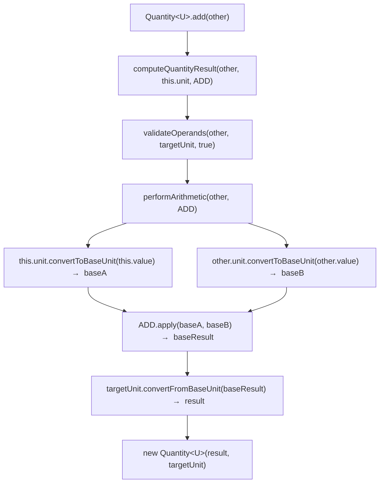
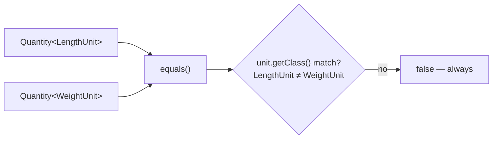

# Data Flow

## Conversion Pipeline

All conversions follow a two-step base-unit normalization:

```
source value  ──×  conversionFactor──▶  base unit value
base value    ──÷  conversionFactor──▶  target value
```

Each unit enum stores its `conversionFactor` as the number of base units one unit equals:

```
LengthUnit.INCHES.conversionFactor = 1/12   (1 inch = 1/12 foot)
WeightUnit.KILOGRAM.conversionFactor = 1000  (1 kg = 1000 grams)
VolumeUnit.GALLON.conversionFactor = 3.78541 (1 gallon = 3.78541 litres)
```

## Arithmetic Data Flow



## Equality Data Flow

```mermaid
flowchart TD
    A["equals(obj)"] --> B{same reference?}
    B -->|yes| T[true]
    B -->|no| C{obj null or wrong class?}
    C -->|yes| F[false]
    C -->|no| D{unit.getClass() match?}
    D -->|no| F
    D -->|yes| E["convert both to base unit"]
    E --> G{"|baseA - baseB| < 1e-7"}
    G -->|yes| T
    G -->|no| F
```

## Cross-Category Safety



The `unit.getClass()` check in `equals()` ensures cross-category comparison always returns `false`, even when using raw types.

## hashCode Consistency

`hashCode` is derived from the base-unit value rounded to 6 decimal places, combined with the unit class name. This ensures:

- `1 ft` and `12 in` produce the same hash (they are equal)
- `1 ft` (LengthUnit) and `1 g` (WeightUnit) produce different hashes (different class names)
